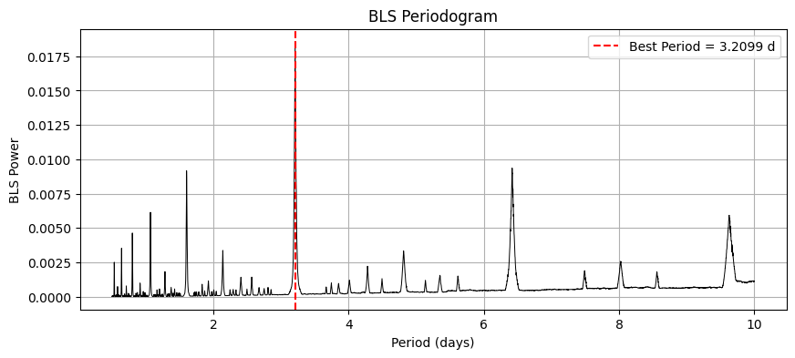
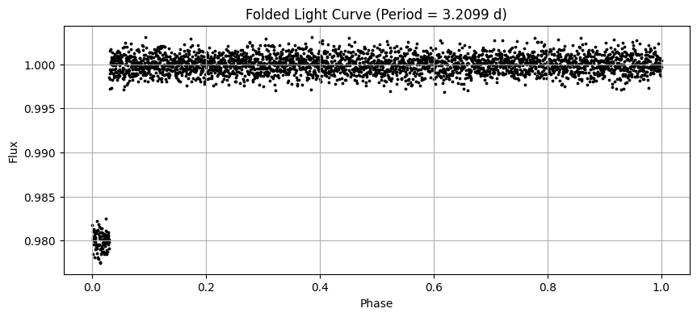

#  Exoplanet Transit Detector (BLS)
A Python tool to detect exoplanet transits in light curves using the **Box Least Squares (BLS)** algorithm.  
Supports simulated or real TESS/Kepler data.

This project demonstrates:
- Time-series analysis  
- Signal detection  
- Exoplanet transit physics  
- Python scientific programming  
- Research-quality software structure  

---

##  What is BLS?

**Box Least Squares (BLS)** is a period-search algorithm designed to detect  
periodic dips in brightness caused by exoplanets crossing in front of their star.

---

---

##  Usage (Python Script)

This will:
- Load the light curve  
- Run BLS  
- Estimate best period  
- Plot periodogram  
- Plot folded transit curve  

---

---

##  Included Sample Data

This repository includes a **simulated exoplanet transit light curve**:

`sample-data/simulated_transit.csv`

The simulated dataset contains:
- Time values (0–27 days)  
- Realistic Gaussian noise  
- Injected transits every **3.21 days**  
- Transit depth ≈ **2%**

Ideal for testing the BLS detector.

---

---

##  Author  
Grace (spacey-g)
---

##  Example Outputs

### 🔹 Raw Light Curve

### 🔹 BLS Periodogram

### 🔹 Folded Transit Curve

